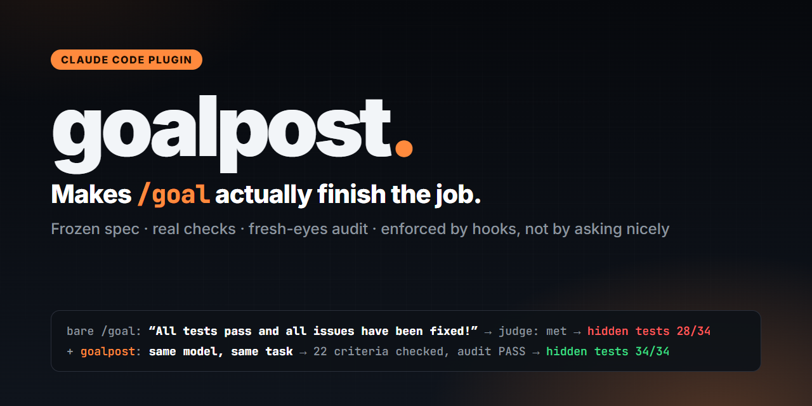

<p align="center">
  
</p>

<p align="center">
  <a href="https://github.com/syntaxixr/goalpost/actions/workflows/test.yml"></a>
  
  
  
  <a href="LICENSE"></a>
</p>

<h3 align="center">Агент пишет «Все тесты проходят!» Скрытые тесты говорят 28/34.<br>goalpost заставляет <code>/goal</code> доказать это, прежде чем Claude остановится.</h3>

<p align="center">
  <a href="https://syntaxixr.github.io/goalpost/docs/media/goalpost.mp4"></a><br>
  <b><a href="https://syntaxixr.github.io/goalpost/docs/media/goalpost.mp4">▶ Смотреть всё демо, 90 секунд</a></b> · два настоящих прогона из бенчмарка, та же модель, та же задача, ничего не подстроено
</p>

<p align="center"><a href="README.md">English</a> · <b>Русский</b></p>

**Установка** (потом открой новую сессию Claude Code и пиши `/goal` как обычно):

```bash
claude plugin marketplace add syntaxixr/goalpost
claude plugin install goalpost@goalpost
```

На Windows можно просто дважды кликнуть [`install.bat`](install.bat). Удалить в любой момент:
`uninstall.bat` / `./uninstall.sh`. Подробно [ниже](#установка).

---

Ты по-прежнему пишешь `/goal <условие>`. Плагин goalpost на хуках превращает каждую цель в
замороженное ТЗ с проверяемыми критериями, не даёт остановиться, пока по каждому критерию нет свежей
проверки и чистого аудита свежим субагентом, не даёт подгонять тесты под код и возвращает план после
сжатия контекста. Это делают хуки, а не просьбы к модели, поэтому пропустить это нельзя.

**Если коротко:** в бенчмарке из 33 прогонов встроенный судья `/goal` сказал «готово» во **всех 17**
голых прогонах, и **8 из них были недоделаны**. С goalpost Sonnet 5.5 закончил **9 из 9** прогонов со
всеми скрытыми проверками зелёными. Все цифры, включая те, где пользы не было, [ниже](#бенчмарк).

## Проблема

`/goal` устроен как Stop-хук на время сессии. После каждого хода маленькая модель (Haiku) читает
переписку и говорит «выполнено», «ещё нет» или «невозможно». Она не запускает команды и не открывает
файлы ([проверено](docs/MECHANICS.md)): если агент убедительно написал «всё готово», оценщик может
поверить. Размытая цель («сделай проект полностью») не говорит, что значит «готово». Плана на диске
нет, и после сжатия контекста нить теряется. А подогнать тест под результат агенту ничто не мешает.

## Установка

Нужны [Claude Code](https://code.claude.com/docs/en/setup) и [Node.js](https://nodejs.org) 18+ (хуки
написаны на Node). Больше ничего. Windows, macOS, Linux.

**Windows:** скачай или склонируй репозиторий и запусти двойным кликом **`install.bat`**.
**macOS / Linux:** `./install.sh`.
Установщик проверит Claude Code и Node, добавит маркетплейс, поставит плагин для твоего пользователя
(во все проекты) и проверит, что он появился в списке.

Или руками в терминале:

```bash
claude plugin marketplace add syntaxixr/goalpost
claude plugin install goalpost@goalpost
```

Потом открой **новую** сессию Claude Code и пользуйся `/goal` как обычно. Попробовать без установки:
`claude --plugin-dir ./plugin`.

### Обновление и удаление

```bash
claude plugin marketplace update goalpost && claude plugin update goalpost@goalpost   # обновить
```

Удалить: **`uninstall.bat`** (Windows) или `./uninstall.sh`, либо руками:
`claude plugin uninstall goalpost@goalpost && claude plugin marketplace remove goalpost`.
После этого `/goal` работает как раньше. Папки `.goal/` внутри проектов остаются (это твои ТЗ и логи),
удали их, если не нужны. Временно выключить, не удаляя: `/goalpost:off`.

## Что происходит на `/goal сделать импортёр`

1. **Сначала ТЗ.** goalpost создаёт `.goal/SPEC.md` и просит агента заполнить: допущения (на открытый
   вопрос агент принимает решение и записывает его, а не спрашивает тебя), этапы для больших задач и
   критерии приёмки. У каждого критерия есть наблюдаемый результат и команда, которая вернёт 0 только
   если он выполнен. Пока нет хотя бы одного критерия, файлы проекта закрыты на запись.
2. **Заморозка.** При первой правке проекта критерии замораживаются. Добавлять можно, убирать или
   ослаблять нельзя без записи в «Spec changes» с названием критерия. Эти записи читает аудитор.
3. **Проверки оставляют след.** `node .goal/verify.js` запускает команды Verify, пишет коды выхода в
   `.goal/evidence.log` и отмечает галочки. Критерий засчитывается, только если последняя проверка
   прошла **после последней правки кода**.
4. **Тесты только для чтения.** Тесты, существовавшие на старте цели, и всё из «Protected» нельзя
   править, удалять или перезаписывать ни через Edit/Write, ни через shell. Если тест правда надо
   изменить, это объявляется в «Test changes» с причиной.
5. **Решает Stop-хук.** Пока что-то не закрыто, Claude не может остановиться, а причина называет
   конкретный критерий: *«AC-3 не проходит проверку (exit 1) … последний вывод: …»*. Хук работает
   параллельно со встроенным оценщиком, так что даже если оценщика убедили «выполнено», сессия
   продолжается.
6. **Аудит свежим взглядом.** Когда всё зелёное, субагент `goalpost:auditor` заново запускает проверки,
   читает код и ищет заглушки, пропущенные тесты и зашитые ответы. Закончить цель можно только после
   `VERDICT: PASS` для текущего кода.
7. **Предохранители.** Одна и та же ошибка 3 раза подряд — требование сменить подход. Три остановки
   подряд без единого вызова инструмента — goalpost отпускает (раньше, чем сработает собственный лимит
   Claude Code в 8). Блокер, который может снять только человек, пишется в `.goal/BLOCKED.md`: goalpost
   останавливается и говорит тебе. `/goal clear` и «невозможно» учитываются.
8. **Переживает сжатие.** После сжатия контекста или `--resume` SPEC и PROGRESS вкладываются заново.

## До и после

```text
Голый /goal                                   /goal + goalpost
─────────────────────────────────────         ──────────────────────────────────────────
агент: «Всё готово, тесты проходят!»          агент: «Всё готово!»
оценщик (видит только текст): выполнено       Stop-хук: блок — AC-4 не проверялся после
→ цель снята, сессия закончилась              последней правки; AC-6 падает (exit 1):
                                              «ожидалось '#N/A', получено '#VALUE!'»
                                              → агент чинит, гоняет verify, аудит PASS, конец
```

Настоящие SPEC и аудит небольшого прогона лежат в [examples/](examples/).

## Команды и настройки

| Команда | Что делает |
| --- | --- |
| `/goalpost:status` | Критерии, проверки, аудит и незакрытые пункты текущей цели |
| `/goalpost:off` / `/goalpost:on` | Общий выключатель. Ещё есть `GOALPOST=off` в окружении |
| `/goalpost:release` | Перестать контролировать текущую цель (встроенный `/goal` продолжает работать) |

Один конфиг: `~/.claude/goalpost.json` (для всех проектов) или `.claude/goalpost.json` (для одного).
Все настройки с умолчаниями лежат в [examples/goalpost.json](examples/goalpost.json): лимиты блокировок,
включение аудита, интервал напоминаний, маски тестов, защищённые пути, таймаут и оболочка для verify.

## Чем отличается

| | goalpost | [Looper](https://github.com/ksimback/looper) | [Ouroboros](https://github.com/Q00/ouroboros) | [claude-goal](https://github.com/jthack/claude-goal) | [goalkeeper](https://github.com/bonfire-systems/goalkeeper) |
| --- | --- | --- | --- | --- | --- |
| Работает со встроенным `/goal` | **да, ты пишешь его как раньше** | проектирует цикл, запускаешь сам | отдельные команды `ooo` | заменяет его | заменяет его |
| Принуждение хуками | **да** | нет (скилл) | частично | только Stop-хук | один PreToolUse-страж |
| Кто решает «готово» | файлы на диске + свежий аудитор | судья по настройке | 3-этапная оценка | сам агент | судья-субагент |
| Нужны доказательства | **свежая проверка после последней правки** | типизированная проверка | механический этап | нет | команда-валидатор |
| Тесты защищены от правок | **да** | нет | нет | нет | частично |
| ТЗ заморожено от ослабления | **да** | нет | seed неизменяем | нет | контракт охраняется |
| Детект повторяющейся ошибки | **да** | стоп без прогресса | паттерны застоя | нет | счётчик отказов |
| Возвращает план после сжатия | **да** | нет | журнал событий | нет | файл лога |
| Что нужно | Node.js | Python + PyYAML | Python 3.12, uv, MCP | Python, SQLite | Python 3 |
| Интервью перед работой | нет (без присмотра) | да | да | нет | да |

Подробные заметки по каждому проекту: [docs/RESEARCH.md](docs/RESEARCH.md).

## Бенчмарк

33 настоящих прогона (Sonnet 5.5 и Haiku 4.5), 4 задачи, скрытые грейдеры, каждый прогон оценён 3 раза ([полный отчёт](docs/BENCHMARK.md)):

| | голый `/goal` | `/goal` + goalpost |
| --- | --- | --- |
| Sonnet 5.5: пройдено скрытых проверок | 99,0%, 8/9 прогонов идеально | **100%, 9/9 идеально** |
| Sonnet 5.5: «готово», хотя проверки падают | 1/9 | **0/9** |
| Haiku 4.5: пройдено скрытых проверок (среднее по 4 задачам) | 79,8% | **89,7%** |
| Haiku 4.5: «готово», хотя проверки падают | 7/8 | 5/7 |
| Время и цена прогона (Sonnet / Haiku) | 2,7 / 5,7 мин, $0,46 / $0,64 | 5,2 / 15,1 мин, $0,91 / $1,25 |

Что это показывает, честно. Встроенный оценщик сказал «выполнено» во **всех 17** голых прогонах, и 8 из них
были недоделаны: он верит тексту агента. С goalpost ни один прогон на Sonnet не закончился с падающими
проверками, а слабая модель выросла (79,8% → 89,7%), но Haiku он **не** делает надёжной: идеально прошёл
только 1 прогон из 7. Цена: примерно вдвое больше денег и в 2–2,6 раза больше времени. На сильной модели
и задачах среднего размера выигрыш по точности маленький (один прогон).

## Ограничения, честно

- **Это стоит времени.** ТЗ, проверки и аудит добавляют ходы. В бенчмарке ветка с goalpost шла
  примерно вдвое дольше и дороже голого `/goal` (Sonnet: 5,2 против 2,7 мин, $0,91 против $0,46). На мелкой задаче это лишнее:
  `/goalpost:off` или `GOALPOST=off claude`.
- **Сильные модели часто и так доделывают.** На Sonnet 5.5 и задачах среднего размера голый `/goal` уже
  давал почти 100%. Польза goalpost видна там, где модель срезает углы. Цифры, включая прогоны, где
  goalpost ничего не изменил, в [BENCHMARK.md](docs/BENCHMARK.md).
- **Защита от записи через shell сделана по эвристике.** Edit/Write в защищённые файлы блокируются
  надёжно. Для Bash/PowerShell goalpost разбирает редиректы, файловые команды (`rm`, `mv`, `sed -i`,
  `Set-Content`…) и вызовы вроде `writeFileSync`. Специально запутанная команда может проскочить, второй
  рубеж — аудитор.
- **Нужен Node.js 18+ в PATH.** Без `node` хуки не запустятся, и Claude Code будет работать так, будто
  goalpost не установлен. Установщик это проверяет.
- **Измерено в неинтерактивном режиме.** Поведение хуков измерено через `claude -p`. Если где-то `/goal`
  не дойдёт до `UserPromptSubmit`, goalpost подхватит цель из записи в транскрипте при первой
  остановке. Этот запасной путь проверен вживую с отключённым хуком
  ([MECHANICS.md §7](docs/MECHANICS.md#7-end-to-end-checks-of-the-finished-plugin)).

## Как это устроено и что измерено

В [docs/MECHANICS.md](docs/MECHANICS.md) записано то, что проверено на Claude Code 2.1.285, а не
угадано: `UserPromptSubmit` видит `/goal <условие>`; `UserPromptExpansion` не видит; `/goal clear` не
вызывает ни одного хука; состояние цели видно в транскрипте; Stop-хук работает параллельно со
встроенным оценщиком; лимит в 8 блокировок считает только остановки без вызова инструментов.

## Разработка

```bash
node --test test/lib.test.js test/hooks.test.js     # 38 тестов, ~10 с
claude --plugin-dir ./plugin                          # попробовать без установки
node bench/run-bench.js --round rX --tasks D --reps 3  # бенчмарк
```

## Лицензия

MIT. Чьи идеи использованы, см. [CREDITS.md](CREDITS.md).
